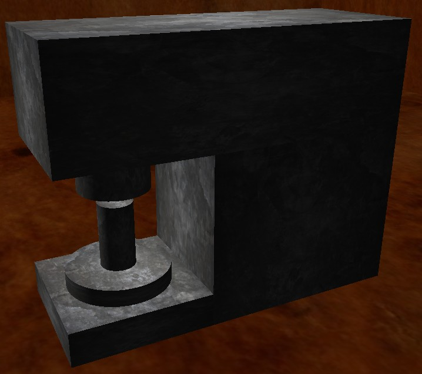
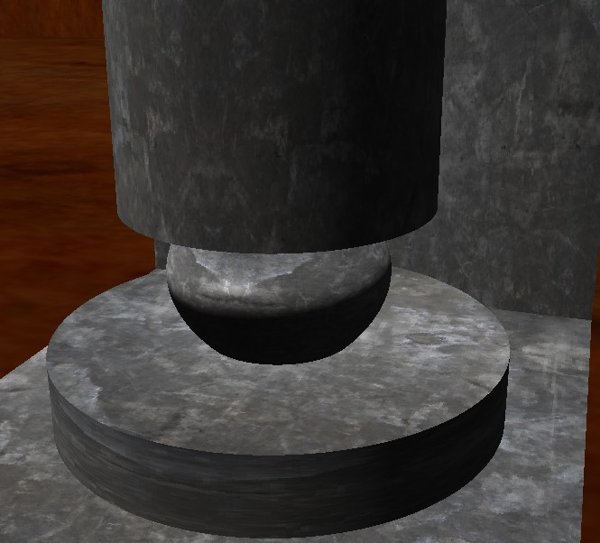

### Computer graphics  
Hydraulic press generated procedurally (OpenGL with C++).  

#### Building  
Build system - cmake (for example: mkdir build, cd build, cmake .., use compiler available on your system).   
  
On Linux I assume that OpenGL, GLFW, GLEW, SOIL are available in system library path. For Windows users, dependancies are included in the repository (this is some kind of workaround, but a convenient one). 
   
Build tested on Manjaro Linux with gcc compiler and on Windows with VisualStudio. I cannot guarantee that it will work everywhere out-of-the-box, as "portable" projects with many dependancies (like graphical libraries) are known to cause build problems for various reasons.  

#### User Interface  
Program uses "FPS" Camera with 5 degrees of freedom. It can be moved with keyboard:  
arrows - move left/right and up/down  
ctrl + arrows - rotate left/right and up/down  
PgUp, PgDown - move forward/backward  

Pressing ESC with end the program.  

#### Example screenshots:  

